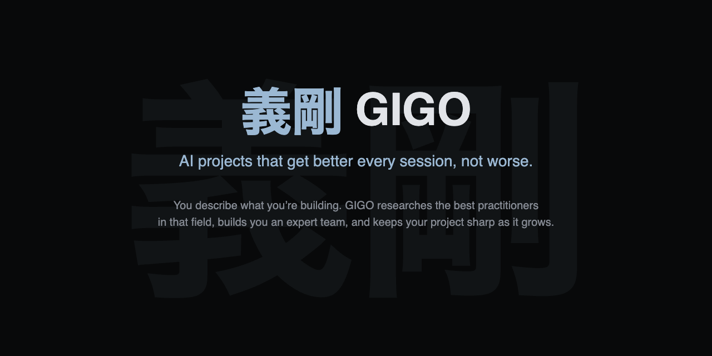

# 義剛 GIGO

Every Claude Code project starts the same way. You add rules, things work great. Next session you add more. A week later your CLAUDE.md is 200 lines of overlapping, stale guidance and your AI output gets worse, not better.

[Research confirms it](https://arxiv.org/abs/2602.11988): bloated context reduces task success rates while increasing cost.

GIGO builds you an expert team that fixes this. Describe what you're building. GIGO researches the best practitioners in that field, real people with real philosophies, and gives you a team that plans, executes, and reviews your work. Your project gets sharper over time, not bigger.

---

## What You Get

Projects that improve with every session instead of rotting. Specs good enough that workers nail it on the first pass. Reviews that find almost nothing because the upstream process already caught it.

---

## Quick Start

```bash
claude plugin marketplace add croftspan/gigo
claude plugin install gigo
```

Open any project in Claude Code. Type `gigo`.

---

## How It Works

1. **Your expert team is active from the start.** GIGO builds a team from real practitioners in your domain. They're working from the first message, not waiting to be called on. They ask the hard questions, catch architectural gaps, and surface the edge cases you'd find at 2am.

2. **Their knowledge becomes a spec.** Whether it's a quick fix or a full redesign, blueprint scales to the task. Either way you get concrete requirements with specific conventions baked in. Everything a worker needs to get it right the first time.

3. **Workers execute from the spec.** They get the requirements, not the rules. First-pass quality validated across any domain. Every run.

4. **Two reviewers catch what one misses.** Spec compliance and output quality as separate passes. Different lenses find different problems.

Your team speaks your language from the first session. During setup, GIGO asks how you want to work. Conversation in your language. Deliverables in whatever languages your project needs.

---

## Your Project Stays Lean

GIGO keeps your always-on context short. Rules that apply to every conversation stay under 60 lines each. Deep knowledge loads only when the task needs it. Zero cost when unused.

At the end of every session, The Snap audits your project: removes what's stale, merges what overlaps, enforces line budgets. The rules that got you into trouble in the first place? They get caught and cleaned before they pile up.

Your project gets sharper over time, not bigger.

---

## Built with GIGO

We use GIGO to build GIGO. Not as a demo. As the way we work.

The review system assumed code. A children's novel project would get reviewed for deadlocks. So we used the pipeline to fix the pipeline. The Challenger found a runtime blocker in its own spec. The fact-checker caught issues in its own design brief. Dangling references, code-specific language that would have survived the fix, a subagent constraint that would crash on first use. All caught before shipping.

Every improvement to GIGO's review system was reviewed by GIGO's review system. The tool improves because we depend on it, and you get something we trust enough to bet our own output on.

[Read the full story &rarr;](site/docs/dogfooding.html)

---

## The Seven Skills

| Skill | What it does |
|---|---|
| `gigo` | Builds your expert team from scratch. Active by default from the first message |
| `gigo:blueprint` | Turns ideas into specs and implementation plans |
| `gigo:execute` | Runs plans by dispatching parallel subagents. Workers get the spec, not the rules |
| `gigo:verify` | Two-stage review: spec compliance + output quality |
| `gigo:snap` | Session-end audit. Projects get sharper, not bigger |
| `gigo:retro` | Turns session friction into project improvements. Every session teaches your project to be better |
| `gigo:maintain` | Adds expertise, audits for bloat, upgrades setups |

---

## See It In Action

**Clear technical brief:**

```
You: "Building a real-time multiplayer game server. Rust.
      WebSocket connections, matchmaking, state sync."

GIGO: "Three on this one:

        The Network Architect
        Carl Lerche's Tokio-driven async pragmatism. The runtime
        is the foundation, get it right or nothing else matters.
        + Glenn Fiedler's game networking gospel. Client-side
        prediction, server authority, snapshot interpolation.
        + Sanjay Ghemawat's systems-level efficiency thinking.
        When you're processing thousands of connections per tick,
        allocation patterns are gameplay decisions.

        The Game State Engineer
        Gabriel Gambetta's client-server game architecture.
        The canonical breakdown of interpolation, prediction,
        and reconciliation. + Jon Blow's data-oriented design
        philosophy. ECS isn't a religion, but your state layout
        determines your tick budget. + Martin Kleppmann's
        distributed systems rigor. State sync is a distributed
        systems problem wearing a game costume.

        The Matchmaker
        Josh Menke's matchmaking philosophy (Halo, Call of Duty).
        Skill rating is easy, match quality is hard. + Raph
        Koster's theory of fun as a design constraint.
        Matchmaking that doesn't produce fun games is technically
        correct and functionally useless.

       Three distinct lenses. Each one disagrees with the others
       on where to spend complexity budget, which is exactly the
       tension you want. Lock it in, or adjustments?"
```

**Vibes-only creative brief:**

```
You: "I want to make a tabletop RPG. Something dark and weird,
      like if Miyazaki directed D&D."

GIGO: "Custom system, no safety net of an existing engine. That's
       more work but more control. Here's who I'd bring in:

        The Mythwright
        Fumito Ueda's design-through-absence. What you don't
        explain is more haunting than what you do. + Miyazaki's
        moral complexity. No pure villains, just beings with
        alien logic. + Kentaro Miura's capacity to make beauty
        feel precarious. Owns your setting, your tone, and the
        question 'does this feel wrong in the right way?'

        The Mechanist
        Vincent Baker's 'fiction first' engine philosophy.
        Apocalypse World proved mechanics should emerge from
        the narrative. + Luke Crane's conviction that the system
        should hurt. Advancement costs something. + Ben Milton's
        Knave-style minimalism. If a rule doesn't create a
        meaningful decision, cut it.

        The Dread Cartographer
        Grant Howitt's one-page game clarity. Honey Heist proved
        you can teach a game in minutes without losing depth.
        + Emmy Allen's Stygian Library approach to procedural
        wonder. Tables that generate mood, not just content.

       Want me to tell you more about any of them, swap someone
       out, or does this feel like the right team?"
```

Same skill, different calibration. Validated across software and fiction. Battle-tested across crypto ops, game design, creative writing, and more.

---

## The Name

義剛 (Gigo), pronounced *ghee-goh* (義 *gi*, righteousness + 剛 *gō*, strong).

In computer science, GIGO means "Garbage In, Garbage Out."

---

Built by Eaven at [Croftspan](https://croftspan.com). Apache 2.0.

[croftspan.github.io/gigo](https://croftspan.github.io/gigo/) · [Research](site/research/) · [Get Started](site/docs/getting-started.html) · [Skills](site/docs/skills.html)
